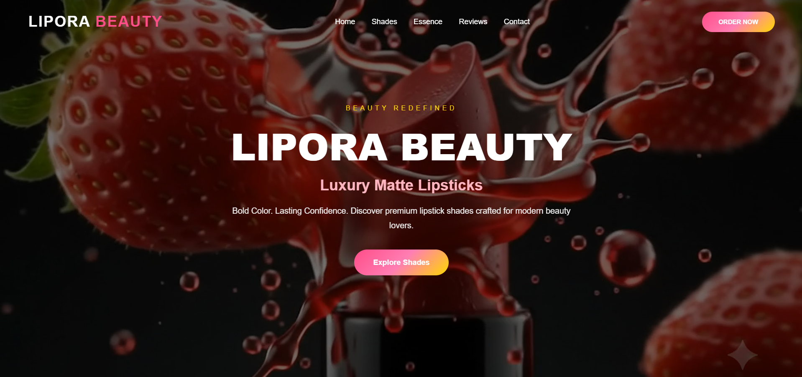
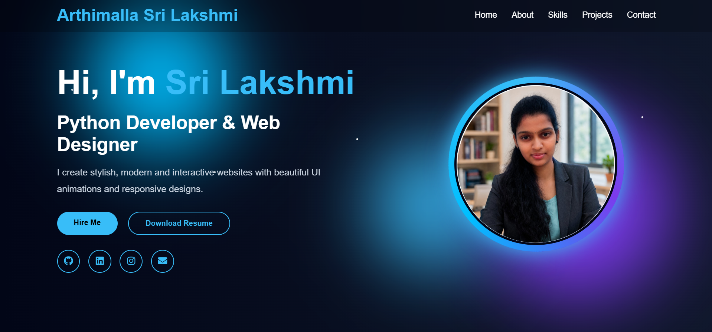

<!-- BANNER -->

  

<!-- DYNAMIC TYPING SUBTITLE -->

  

<!-- SNAKE CONTRIBUTION GRAPH -->

  <picture>
    <source media="(prefers-color-scheme: dark)" srcset="https://raw.githubusercontent.com/arthimalla44/arthimalla44/output/github-contribution-grid-snake-dark.svg">
    <source media="(prefers-color-scheme: light)" srcset="https://raw.githubusercontent.com/arthimalla44/arthimalla44/output/github-contribution-grid-snake.svg">
    
  </picture>

<!-- BADGES -->

  
  
  

  <!-- START_SECTION:deployments -->
  
  <!-- END_SECTION:deployments -->

  

<!-- OPEN TO WORK / HIRE ME -->

  
    
  

<!-- ACHIEVEMENTS -->
## 🏆 Achievements

  

✨ Building modern and responsive web applications

🚀 Learning Data Structures & Algorithms consistently

💻 Developing projects using HTML, CSS, JavaScript & Python

🎯 Focused on becoming a skilled Software Engineer

🌱 Exploring new technologies and improving every day

🤝 Open to internships, collaborations, and exciting opportunities

 

## ⚡ About Me

<table>
  <tr>
    <td width="30%">
      
    </td>
    <td width="70%">
      <h2>Hello! I'm <b>Arthimalla Sri Lakshmi</b> 👋</h2>
      

        A passionate B.Tech student interested in Frontend Development, Python Programming, and Problem Solving. I enjoy building modern web applications and continuously improving my technical skills.
      

      <ul>
        <li>💻 Frontend Developer | Python Learner</li>
        <li>🎓 B.Tech Student</li>
        <li>📚 Currently learning Data Structures & Algorithms</li>
        <li>🚀 Building projects with HTML, CSS, JavaScript, and React</li>
        <li>☁️ Exploring Cloud Computing and AI Technologies</li>
        <li>📍 Based in Andhra Pradesh, India</li>
        <li>📫 Reach me: <a href="YOUR_LINKEDIN_URL">LinkedIn</a> · <a href="mailto:arthimalla44@gmail.com">Email</a></li>
        <li>⚡ Fun Fact: I love turning creative ideas into interactive websites! ✨</li>
      </ul>
    </td>
  </tr>
</table>

 

  

## 🚀 TOP PROJECTS 📌

### 🌐 [PORTFOLIO WEBSITE](	portfolio44.bytexl.live) 

**Personal Portfolio Website Showcasing My Skills & Projects**

* Showcases my skills, certifications, and projects.
* Modern and responsive user interface.
* Built using HTML, CSS, and JavaScript.
* Includes About Me, Skills, Projects, and Contact sections.
* Optimized for desktop and mobile devices.
* Designed to represent my learning journey and growth.

 

  

<h2>### 💄 LIPORA BEAUTY</h2>(	lipora.bytexl.live) 

**Modern Beauty & Cosmetics Landing Page**

* Premium beauty and cosmetics landing page.
* Modern and attractive UI with elegant design.
* Fully responsive across desktop and mobile devices.
* Interactive buttons and smooth user experience.
* Showcases luxury lipstick collections and products.
* Built using HTML, CSS, and JavaScript.

  

## 🛠️ Tech Stack

### Programming

### Frontend

### Backend

### Databases

### Tools & Platforms

 

  

<h1>🌱 Currently Learning</h1> 

### 🎯 Main Focus: Frontend Development & Data Structures

| 🛠️ Technology | 🚀 Goal |
|--------------|----------|
| 💻 HTML, CSS & JavaScript | Build Responsive and Interactive Websites |
| ⚛️ React.js | Develop Modern Frontend Applications |
| 📚 Data Structures & Algorithms | Improve Problem Solving & Interview Skills |
| 🐍 Python | Strengthen Programming Fundamentals |
| ☁️ Cloud & AI Basics | Explore Emerging Technologies |

 

  

<h1>## 📊 GitHub Analytics</h1>

 

  

## 📬 Let's Connect

| 💼 **LinkedIn** | 🐙 **GitHub** | 🌐 **Portfolio** |
| :---: | :---: | :---: |
|  |  |  |
| 📧 **Email** | 📂 **Resume** | 🚀 **Projects** |
|  |  |  |

 

*Feel free to connect with me. I'm always interested in learning, collaborating, and building innovative projects.*

 

  <strong>Let's build something amazing together! 🚀</strong>

<!-- FOOTER -->

  

